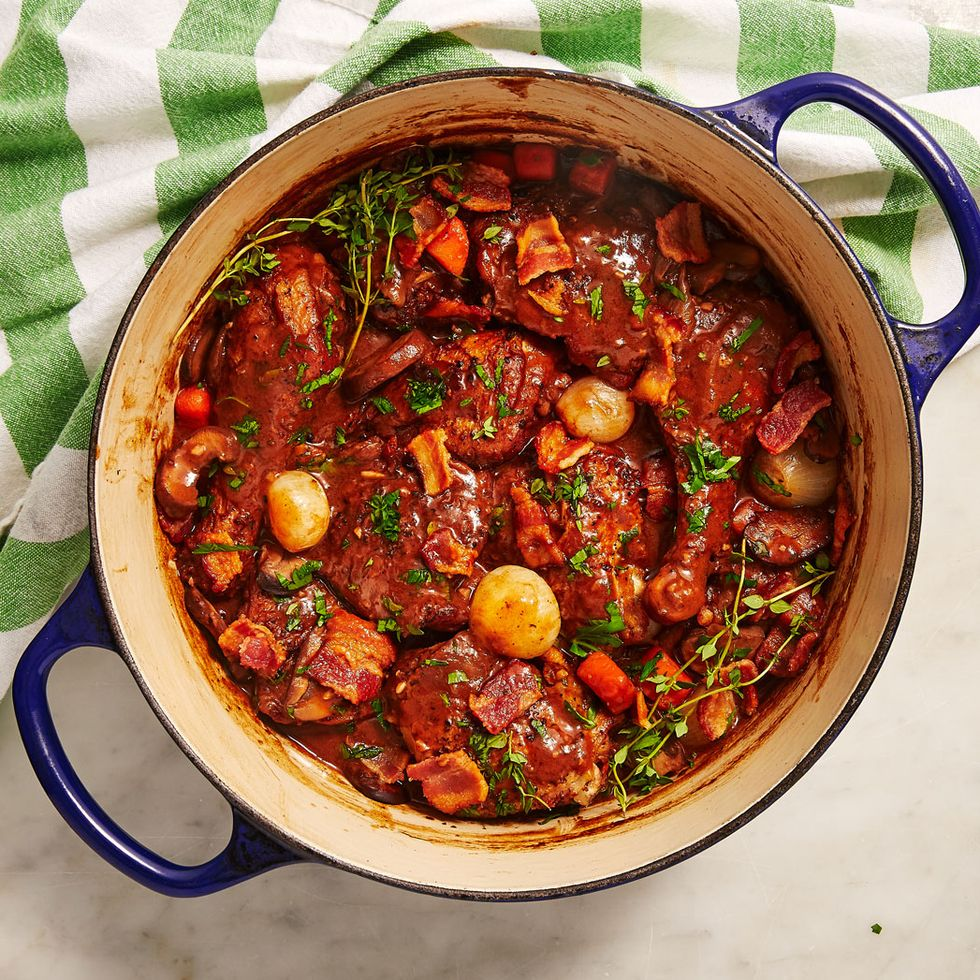

# Coq Au Vin
_Coq Au Vin_, or rooster with wine, is a classic French dish that isn't as complicated as it sounds. Chicken is braised in a silky wine sauce and finished off with butter for the most perfect sauce. Use a nice red wine here and even better if it's from Burgundy! Bacon, mushrooms, and pearl onions give this dish much flavor and makes this one of my favorite chicken dinners to make for guests. They're always so impressed! 

