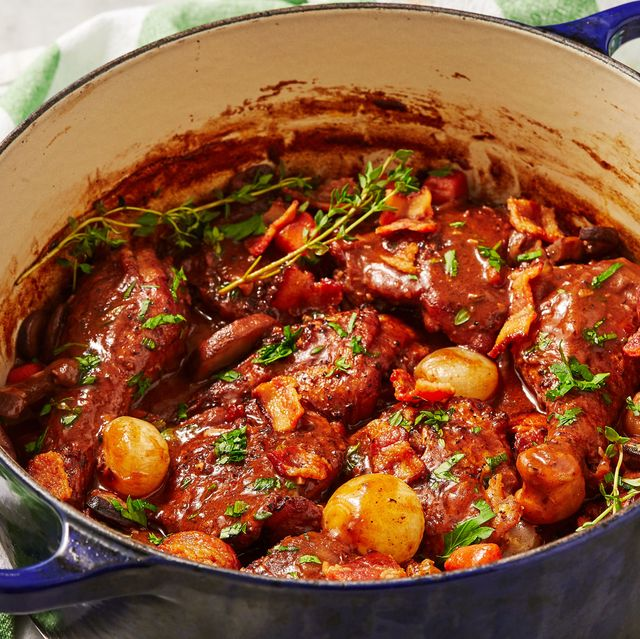

# Recipe
1. Preheat the oven to 350°. Season chicken all over with salt and pepper.
1. In a large dutch oven over medium heat, add bacon and cook until crispy, about 8 minutes. Using a slotted spoon, remove bacon to a paper towel-lined plate. 
1. To same pot, add chicken, working in batches as necessary. Cook until skin is golden, 4 to 5 minutes per side. Remove chicken to a plate. Drain all but 3 tablespoons oil from pot. 
1. To same pot, add mushrooms, onions, and carrots and cook until golden, about 5 minutes. Add garlic and cook until fragrant, 1 minute more. Add tomato paste and stir to coat vegetables, then add flour and stir until vegetables are coated. Slowly pour in wine, broth, and brandy. Return chicken and half the bacon to pot. Add thyme, season with salt and pepper and bring to a boil. 
1. Once boiling, cover with lid and place in oven. Cook until chicken is cooked through and internal temperature reads 165°, 20 to 30 minutes. Remove chicken from pot and place on a plate to keep warm. 
1. Return pot to stove over medium heat, add in butter, and simmer until sauce is thickened, about 10 minutes. 
1. Serve chicken with sauce poured over and topped with remaining bacon and parsley. 
-----
